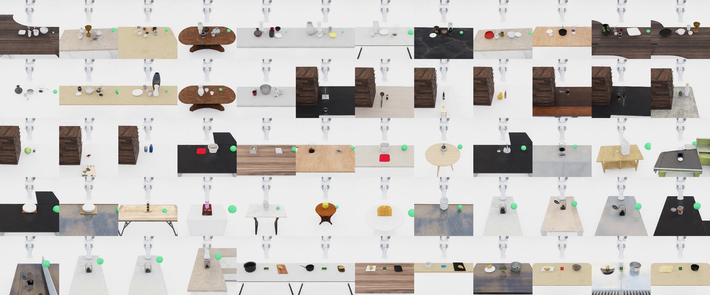

<h1 align="center">ManiGuard</h1>

<p align="center">
  
</p>

<p align="center">
  LTL-safe task generation, teleop &amp; scripted data collection, VLA fine-tuning,
  and evaluation — on top of
  <a href="https://github.com/StanfordVL/BEHAVIOR-1K">BEHAVIOR-1K</a> / OmniGibson.
</p>

<p align="center">
  <a href="https://nu-ideas-lab.github.io/ManiGuard/"><b>📖 Documentation</b></a>
  &nbsp;·&nbsp;
  <a href="#installation">Installation</a>
  &nbsp;·&nbsp;
  <a href="#task-generation--benchmark">Task generation</a>
  &nbsp;·&nbsp;
  <a href="#sft--rl">SFT + RL</a>
</p>

## Repository layout

```
.
├── maniguard/            # ManiGuard Python package (all maniguard-owned code)
│   ├── _omnigibson_patches.py   # runtime patches on vanilla OmniGibson
│   ├── object_states/   #   Dropped, Upright
│   ├── utils/           #   ltl_utils, safety_monitor, task_spec, geometry
│   ├── task_generation/ #   clutter / stack / transfer / lid / liquid / cabinet / jar pipelines
│   ├── envs/            #   scene registry + frozen-snapshot runtime (no live env class)
│   ├── data/            #   datagen (scripted SFT demo collection), teleop, lerobot, real_teleop, scene + playback
│   ├── eval/            #   benchmark runner, goal checker, scene discovery
│   └── serve/           #   websocket VLA policy server (openpi_native)
├── behavior-1k/         # submodule → StanfordVL/BEHAVIOR-1K @ v3.7.2
├── vla_models/          # VLA checkpoints (user-downloaded, .gitignore)
├── tests/               # maniguard-side tests
├── configs/             # eval / RL / SFT training configs
├── scripts/             # shell entry points
├── tools/               # one-off utilities
└── teleop_bridge/       # ZMQ bridge for SO-101 teleop
```

## Installation

1. **Clone with submodules**:

   ```bash
   git clone --recursive git@github.com:NU-IDEAS-Lab/ManiGuard.git
   cd ManiGuard
   # or, if already cloned:
   git submodule update --init --recursive
   ```

2. **Install BEHAVIOR-1K + download its dataset.** `setup.sh` both
   creates the `behavior` conda env (with OmniGibson, bddl3, JoyLo,
   primitives) and — with `--dataset` — downloads the encrypted
   BEHAVIOR-1K asset bundle into `behavior-1k/datasets/` (matching
   upstream's expected layout, which is also OmniGibson's default
   resolver path — no env var needed afterwards):

   ```bash
   cd behavior-1k
   ./setup.sh --new-env --omnigibson --bddl --joylo --dataset --eval --primitives
   cd ..
   ```

   If you keep the dataset somewhere else (shared HPC storage, etc.)
   set `OMNIGIBSON_DATA_PATH=/abs/path/to/datasets` to override.

3. **Install maniguard** in the conda env (editable, from repo root):

   ```bash
   conda activate behavior
   pip install -e .                 # base install
   pip install -e ".[serve]"        # with websocket policy server extras
   ```

4. **Install the ManiGuard-Bench robot asset** (required to run the benchmark).
   The benchmark uses a Franka Panda with extended **fin-ray fingers** that is
   *not* part of the stock OmniGibson robot set. Download it into the robot-assets
   tree so the runtime patch can find it (default data root is `behavior-1k/datasets/`,
   or `$OMNIGIBSON_DATA_PATH` if you set it):

   ```bash
   hf download IDEAS-Lab-Northwestern/franka-panda-longfinger --repo-type dataset \
     --local-dir behavior-1k/datasets/omnigibson-robot-assets/models/franka/franka_panda_longfinger
   ```

   On `import maniguard`, `FrankaPanda` is auto-redirected to this bundle whenever
   it is present at `<data_root>/omnigibson-robot-assets/models/franka/franka_panda_longfinger/`.

5. **ManiGuard-Bench scenes.** The frozen benchmark (per-task `scene_ep1.json` +
   `diagnostics.jsonl` + review videos) is hosted at
   [`IDEAS-Lab-Northwestern/ManiGuard-Bench`](https://huggingface.co/datasets/IDEAS-Lab-Northwestern/ManiGuard-Bench).
   Eval accepts the HF repo id directly (snapshot-downloaded into the HF cache) or a
   local directory:

   ```bash
   # A) let eval pull it (needs `huggingface-cli login` while the repo is private)
   python -m maniguard.eval.benchmark --benchmark-root IDEAS-Lab-Northwestern/ManiGuard-Bench ...
   # B) or download once and pass the local dir
   hf download IDEAS-Lab-Northwestern/ManiGuard-Bench --repo-type dataset --local-dir datasets/maniguard-bench
   ```

   The bench scenes live under a different root than `behavior-1k/datasets/` on
   purpose: BEHAVIOR assets are Stanford-licensed and not redistributable, whereas
   the ManiGuard-Bench scenes + the longfinger robot asset are ours (CC BY 4.0 /
   Apache-2.0 respectively). See
   [`maniguard/task_generation/README.md`](maniguard/task_generation/README.md) for
   how the pipelines write scenes.

Importing `maniguard` applies a small set of runtime patches that extend
OmniGibson with ManiGuard-specific object states, BDDL predicates, grasp-goal
hold-step counting, a link-fallback-aware grasp reward, and a tensor-safe
`draw_debug_markers`. Set `SENTINEL_SKIP_OMNIGIBSON_PATCH=1` to skip the
patches entirely (useful for pure-Python consumers that don't need
OmniGibson at runtime).

## LTL safety monitoring

- `LTLMonitor` ([`maniguard/utils/ltl_utils.py`](maniguard/utils/ltl_utils.py))
  compiles each LTL formula to a deterministic **Spot** monitor automaton and
  tracks its state per step; a state from which no accepting state is reachable
  (`doomed`) is a safety violation.
- Propositions (`upright`, `dropped`, `ontop`, `open`, …) are evaluated from
  live OmniGibson object states each step by `SafetyPropositionEvaluator`.
- `TaskLTLMonitor`
  ([`maniguard/utils/safety_monitor.py`](maniguard/utils/safety_monitor.py))
  wires the two together for a rollout — `step()` advances the automaton and
  records violations (no standalone env class). It is driven by both task-gen
  rollouts and the VLA policy eval
  ([`maniguard/eval/benchmark.py`](maniguard/eval/benchmark.py), where safety
  only records and never ends the episode).

Where the spec comes from:

- **Current** — task-gen pipelines embed each task's `ltl_safety` spec
  (constraints + propositions + combined LTL formula) inline in its
  `diagnostics.jsonl`, and it is passed to `TaskLTLMonitor` directly. The VLA
  eval reads it back from there (no filesystem lookup).
- **Legacy** `ltl_safety.json` files (still merged when present, via the
  `scene_model` arg): task-level under
  `behavior-1k/bddl3/bddl/activity_definitions/<activity>/`, scene-level under
  `datasets/behavior-1k-assets/scenes/<scene>/safety/`.

Object resolution: propositions reference objects by glob pattern (`teacup_*`,
`roaster_*`, `desk.n.01_*`). With a BDDL `object_scope` they resolve against it;
for scenes without one (e.g. the benchmark's `DummyTask`), the eval reconstructs
`{inst_id: obj}` from the patterns — matching each to a loaded object by
category, by synset lemma (via `bddl`'s `ObjectTaxonomy`, so `roaster_*` finds a
`roasting_pan`), or by name.

Spot is an optional dependency for task-gen (LTL is skipped with a warning if
missing), but the policy eval **fails fast**: a benchmark carrying a safety spec
refuses to run without a functional Spot runtime
(`conda install -c conda-forge spot` — not `pip install spot`, a different
package).

## Task generation + benchmark

Pipelines live in [`maniguard/task_generation/`](maniguard/task_generation/).
Each pipeline auto-discovers a surface in the target scene, generates a
BDDL problem and `ltl_safety.json`, spawns objects, places the mounted
Franka, and runs an LTL-monitored rollout. See
[`maniguard/task_generation/README.md`](maniguard/task_generation/README.md)
for flags + the full taxonomy of available pipelines.

```bash
conda activate behavior

# Single scene, BDDL + LTL dry-run (no simulator)
python -m maniguard.task_generation.clutter_scene_pipeline \
  --scene-model Benevolence_1_int --dry-run

# Full-sim rollout
python -m maniguard.task_generation.clutter_scene_pipeline \
  --scene-model Benevolence_1_int --episodes 1 --steps 300 \
  --save-video --strict-gate

# Multi-scene benchmark
python -m maniguard.task_generation.run_benchmark \
  --pipeline table --steps 300 --episodes 1 --timeout 300 --save-video
```

Run `OMNIGIBSON_HEADLESS=1 VK_ICD_FILENAMES=/usr/share/vulkan/icd.d/nvidia_icd.json`
on headless nodes.

## VLA policy evaluation

ManiGuard evaluates vision-language-action policies over websocket: the
policy runs in its own process (Pi0.5 / GR00T / GR00T-N1.6), the
environment loop runs in another, and
[`maniguard/eval/benchmark.py`](maniguard/eval/benchmark.py) drives one
scene at a time off a local dir or HuggingFace dataset repo. A per-scene
wrapper is in [`scripts/run_benchmark_all_scenes.sh`](scripts/run_benchmark_all_scenes.sh)
because OmniGibson can't reliably reload scenes in the same process —
the wrapper spawns one Python per scene and aggregates the
`results.jsonl` files afterwards.

**Terminal 1 — serve the policy** (`maniguard.serve.openpi_native` auto-detects
JAX vs PyTorch checkpoints):

```bash
openpi/.venv/bin/python -m maniguard.serve.openpi_native \
    --config pi05_clutter_libero_lora \
    --checkpoint vla_models/<ckpt>/<step>
```

The observation / action schema is driven by the eval config (`state_mode` /
`obs_layout`) plus the policy's training config — see
[`docs/sft/end_to_end.md`](docs/sft/end_to_end.md).

**Terminal 2 — drive the eval loop**:

```bash
# Single scene (local dir)
python -m maniguard.eval.benchmark \
    --benchmark-root datasets/safety-benchmark \
    --host 127.0.0.1 --port 8000 --max-steps 300 --save-video

# All scenes in a HuggingFace-hosted benchmark (per-scene subprocess)
bash scripts/run_benchmark_all_scenes.sh \
    --benchmark-root IDEAS-Lab-Northwestern/sentinel-lite-taskgen-staging-20260415-v1 \
    --host <policy_host> --port 8000 --max-steps 300 --save-video
```

Per-episode artefacts land in `outputs/benchmark_eval/<scene>/`. Goal
checking uses real OmniGibson states via
[`maniguard/eval/goal_checker.py`](maniguard/eval/goal_checker.py) against
the pipeline-generated `diagnostics.jsonl`.

## SFT + RL

**SFT** — supervised fine-tuning of a VLA on the collected demos. The dataset is
**model-agnostic**: one joint-controller LeRobot v2.1 dataset feeds any VLA
(openpi / GR00T / SmolVLA). See [`docs/sft/`](docs/sft/index.md) — the
[dataset & data-source configs](docs/sft/dataset_and_config.md), the
[openpi/pi0.5 recipe](docs/sft/openpi.md), and the
[controller/action/eval consistency](docs/sft/end_to_end.md).

**RL** — grasp / pick-and-lift RL training (Stable-Baselines3 PPO on OmniGibson) is
**under development** and not yet part of the mature pipeline.

## Teleoperation (SO-101 / GELLO → Franka)

Two leader options:

| Leader | Mapping | Follower controller | Hardware coupling |
|---|---|---|---|
| **SO-101** | EE deltas → Franka IK targets | `InverseKinematicsController` | 6-DOF heterogeneous, ZMQ bridge |
| **GELLO** | Joint angles 1:1 (kinematic twin) | `JointController(position)` | 7-DOF Dynamixel daisy-chain, in-process |

Recordings from either go to HDF5 trajectories compatible with the SFT
data prep script above. Action layouts differ (IK delta vs absolute
joint), so don't mix them in the same dataset.

### SO-101 leader → Franka

Two-process setup (LeRobot's 3.12 venv for the hardware side, ManiGuard's
`behavior` conda env for OmniGibson), bridged by ZMQ at ~60 Hz. Detailed
hardware setup + ZMQ schema:
[`teleop_bridge/README.md`](teleop_bridge/README.md).

**Terminal 1** — SO-101 server (LeRobot venv):

```bash
conda activate lerobot
# Real hardware:
python teleop_bridge/so101_server.py --port /dev/ttyACM0
# Mock mode (no physical arm needed):
python teleop_bridge/so101_server.py --mock
```

**Terminal 2** — Franka teleop in OmniGibson (`behavior` env):

```bash
conda activate behavior
python -m maniguard.data.teleop.so101_franka_teleop \
    --snapshot outputs/pipeline_runs/<run>/scene_ep1.json \
    --output-hdf5 outputs/teleop/demo.hdf5 --only-successes
```

**Playback** a recorded trajectory (with optional observation dump for
dataset curation):

```bash
python -m maniguard.data.teleop.so101_franka_playback \
    --input outputs/teleop/demo.hdf5 \
    --output outputs/teleop/demo_obs.hdf5 --record
```

### GELLO leader → Franka

Single-process — `gello` is bundled inside `behavior-1k/joylo/` so we add
it to `PYTHONPATH` instead of pip-installing (avoids pulling telemoma /
joycon / pyglm). Built-in `os.environ.setdefault("VK_ICD_FILENAMES", ...)`
so you don't need to export it each run.

**One-time hardware calibration** — flash unique IDs (1–7) and 2 Mbps
baudrate to all 7 Dynamixels via Dynamixel Wizard 2.0, then with the
GELLO physically posed at a repeatable reference (e.g. `joint 2` at its
back-tilt limit, `joint 4` at its forward-bend limit, others in middle):

```bash
PYTHONPATH=behavior-1k/joylo \
python behavior-1k/joylo/scripts/gello_get_offset.py \
    --port /dev/serial/by-id/usb-FTDI_USB__-... \
    --start-joints 0 -1.7628 0 -3.0718 0 -0.0175 0 \
    --joint-signs 1 -1 1 1 1 1 1 \
    --no-gripper
```

The printed `best offsets` array goes into `GELLO_JOINT_OFFSETS` near the
top of `maniguard/data/teleop/gello_franka_teleop.py`. Update `JOINT_SIGNS`
similarly if joints move backwards in sim. Calibration only needs to run
once (or after re-flashing servos / changing geometry).

**Run teleop:**

```bash
conda activate behavior
python -m maniguard.data.teleop.gello_franka_teleop \
    --snapshot outputs/teleop_scenes/table/scene_ep0000.json \
    --output-hdf5 outputs/gello_teleop_hdf5/table/scene_ep0000.hdf5 \
    --only-successes
```

**Hotkeys** (focus the OmniGibson viewport):

| Key | Action |
|---|---|
| `SPACE` | Toggle gripper open/close (no physical gripper yet — keyboard substitutes) |
| `S` | Toggle success flag (with `--only-successes`, episodes only persist if S was pressed) |
| `C` | Save checkpoint |
| `R` | Rollback to last checkpoint |
| `Q` | Clean exit (writes HDF5) |

**Useful flags** (shared with `so101_franka_teleop` where applicable):

- `--grasping-mode {physical,assisted,sticky}` — `assisted` welds objects via FixedJoint when both fingers contact, useful for thin/flat-object slip
- `--gpu-dynamics` — required for fluid / particle / cloth scenes (e.g. `liquid_transport` family); off by default to save VRAM
- `--invert-gripper` — swap which SPACE state means open vs close

(Long-finger Franka assets are now patched in eagerly via
`maniguard/_omnigibson_patches.py:_patch_franka_longfinger` whenever the
long-finger bundle exists under
`omnigibson-robot-assets/models/franka/franka_panda_longfinger/`. Use
`scripts/build_franka_panda_longfinger_assets.py` to construct the
bundle from stock Panda assets if it isn't already present.)

### Batch teleop (sweep a family)

`scripts/run_teleop_batch.sh` iterates every `scene_ep*.json` under a
task family. Currently hardcoded to the SO-101 entry point — for GELLO,
either edit the `python -m maniguard.data.teleop.so101_franka_teleop` line in
the script, or use a shell loop:

```bash
# SO-101 — built-in:
bash scripts/run_teleop_batch.sh --task table

# GELLO — shell loop:
for snap in outputs/teleop_scenes/table/scene_ep*.json; do
    out="outputs/gello_teleop_hdf5/table/$(basename "$snap" .json).hdf5"
    [[ -f "$out" && $(stat -c%s "$out") -gt 8192 ]] && continue   # skip already-collected
    python -m maniguard.data.teleop.gello_franka_teleop \
        --snapshot "$snap" --output-hdf5 "$out" --only-successes
done
```

Output dir defaults to `outputs/jixing_teleop2_hdf5/<family>/` (SO-101)
or whatever you point GELLO's `--output-hdf5` at; cross-family
`scene_ep<NNNN>` collisions are avoided by per-family subdirectories.

## Common manipulation-safety predicates

Useful BDDL predicates for expressing safety-critical constraints (see
[BEHAVIOR Synsets knowledge base](https://behavior.stanford.edu/knowledgebase/synsets/index.html)
for object-level properties):

`on_fire(?obj)`, `hot(?obj)`, `touching(?a, ?b)`, `grasped(?a, ?b)`,
`covered(?a, ?b)`, `broken(?obj)`, `ontop` / `inside` / `nextto`,
`filled(?container, ?liquid)`, `toggled_on(?obj)`, plus ManiGuard's own
`upright(?obj)`, `dropped(?obj)`, `stashed(?obj)`.
