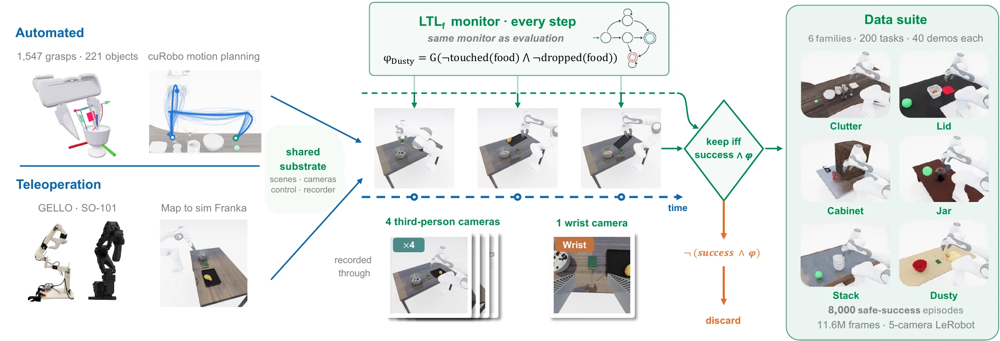
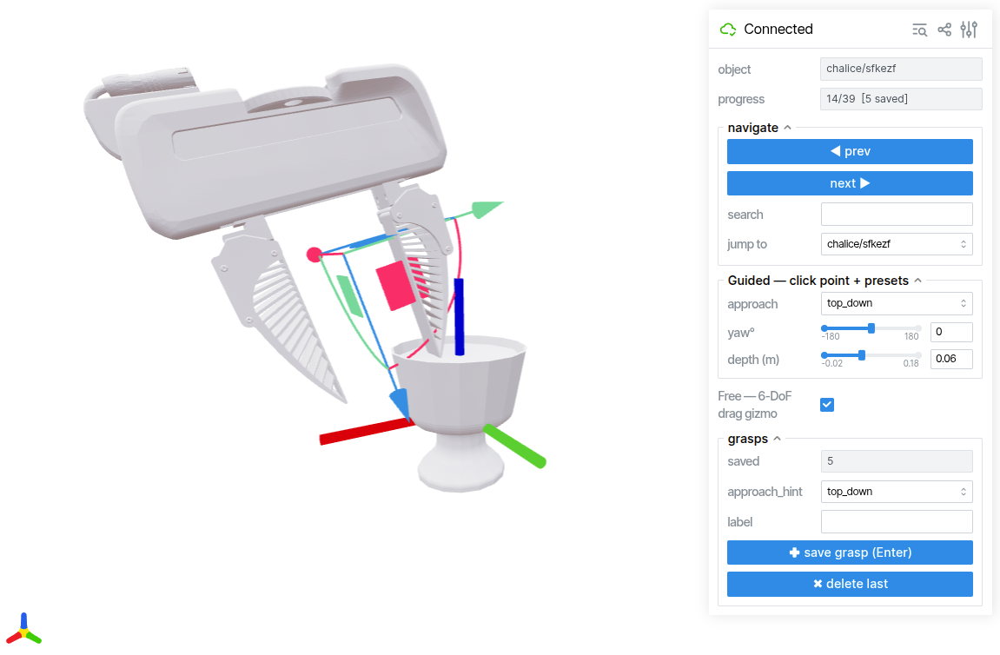
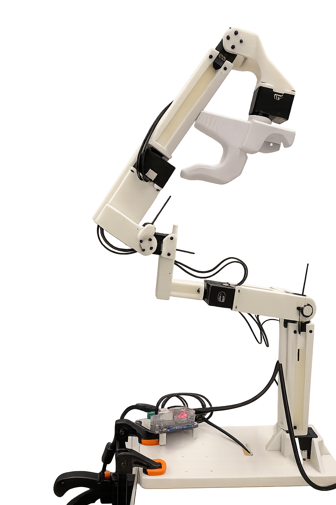

# Data collection

The data-collection stage turns a frozen task (from [task generation](../pipelines/index.md))
into manipulation demonstrations. There are two collection methods, documented in full on
this page:

1. **[Scripted datagen](#scripted-datagen)** (autonomous, sim only) — the **primary data
   engine**: the 6-family pipeline replays a frozen bench task and executes it
   autonomously, keeping only success + LTL-safe demos. This is what produced the shipped
   `datagen-<fam>-v1-joint-5cam` datasets.
2. **[Teleop](#teleop)** (human-driven) — drive the **simulated** Franka with an SO-101 or
   GELLO leader arm; real Franka teleop captures convert through the same export.

```
task-gen / bench frozen scene
        │
        ├─►  scripted datagen  ─►  RAW (hdf5 + videos)  ─►  to_lerobot  ─►  LeRobot v2.1 → SFT
        │     (data/datagen)                                                     ▲
        │
        └─►  human teleop  ─►  raw HDF5  ─►  playback render  ─►  SFT HDF5  ─────┘
              (data/teleop)                  (data/playback)
```

<figure markdown>
  { loading=lazy }
  <figcaption>Both collection routes share one substrate (scenes, cameras, control, recorder) and one per-step LTL<sub>f</sub> monitor — the same monitor used for evaluation. The released suite is produced by the scripted generator and contains 8,000 automatically generated, monitor-verified safe-success episodes across the six families.</figcaption>
</figure>

---

## Scripted datagen

The **`maniguard/data/datagen/`** pipeline turns the read-only **ManiGuard-Bench**
base tasks into large numbers of **success + safe** demonstrations — fully scripted,
no teleop, no per-trajectory human review. The only human input is the grasp source:
each grasp is **authored once** in a GUI and stored as a 6-DOF end-effector pose.

<video autoplay muted loop playsinline controls width="768" style="max-width:100%; border-radius:6px;">
  <source src="datagen_6fam_montage.mp4" type="video/mp4">
</video>
<p style="text-align:center;"><em>One representative scripted demonstration per family — collected fully autonomously.</em></p>

```
grasp annotation DB ─►┐
                      ├─►  cuRobo planning  ─►  per-family motion segments  ─►  demo
frozen bench task  ─► ┘         (execute + record every step)                   │
                                                                success gate ───┤ keep only
                                                                LTL safety gate ┘ success+safe
```

!!! abstract "Design in one line"
    A *generic executor* plans / executes / gates / records / scales every family
    identically; each *family skeleton* only declares **which motion segments make up
    the task**. They meet at one interface (`MotionSegment` + `FamilySkeleton`), so
    adding a family is "new task semantics, everything else reused."

### The six stages

Three groups — **prep** (once per object set), **collection** (per base task), and
**offline** repackaging. Each stage is a section below:

```
   ┌─ one-time, per object set ──────────────────────────────────────────┐
1. extract_meshes      bench tasks ─► object-local GLB + bbox + gripper mesh   (1 OG session)
2. annotate_tool       viser GUI   ─► grasp_annotations.json (eef-target poses) (NO sim)
   └─────────────────────────────────────────────────────────────────────┘
   ┌─ collection, per base task (one OG process each) ───────────────────┐
3. driver.run_task     base task   ─► N success+safe demos (reset-reuse loop) (sim)
4. sweep               many tasks  ─► one subprocess per task, sharded/parallel
   └─────────────────────────────────────────────────────────────────────┘
   ┌─ offline, no sim ───────────────────────────────────────────────────┐
5. review              demos       ─► per-task montage MP4 (quick visual review)
6. to_lerobot          demos       ─► LeRobot v2.1 per family (video passthrough)
   └─────────────────────────────────────────────────────────────────────┘
```

### Pre-collected datasets & continued collection

The task source is
**[ManiGuard-Bench](https://huggingface.co/datasets/IDEAS-Lab-Northwestern/ManiGuard-Bench)**
— 6 families, **200 base tasks**, each with a clean in-distribution (ID) instance plus
4 out-of-distribution (OOD) perturbations (appearance / language / location /
environment). This pipeline has already collected a large demonstration set against
**every** base task, and it is **open-ended**: point it at any task and collect as many
more demos as you want.

**Shipped v1 datasets (public on Hugging Face).** For every base task, **40
mutually-distinct, success + LTL-safe** trajectories — **8,000 episodes / ~11.6 M
frames** total — published as **LeRobot v2.1** (8-D joint state/action, 4 third-person +
1 wrist camera, 30 FPS, 256×256):

| Family (bench) | Base tasks | Episodes (×40) | Frames | HF dataset (`<org>/…`) |
|---|---:|---:|---:|---|
| [`clutter_pickup`](https://huggingface.co/datasets/IDEAS-Lab-Northwestern/datagen-clutter-v1-joint-5cam) | 55 | 2,200 | 901,520 | `datagen-clutter-v1-joint-5cam` |
| [`cabinet_pickup`](https://huggingface.co/datasets/IDEAS-Lab-Northwestern/datagen-cabinet-v1-joint-5cam) | 35 | 1,400 | 4,172,962 | `datagen-cabinet-v1-joint-5cam` |
| [`stack_retrieve`](https://huggingface.co/datasets/IDEAS-Lab-Northwestern/datagen-stack-v1-joint-5cam) | 28 | 1,120 | 2,652,083 | `datagen-stack-v1-joint-5cam` |
| [`jar_transport`](https://huggingface.co/datasets/IDEAS-Lab-Northwestern/datagen-jar-v1-joint-5cam) | 26 | 1,040 | 946,870 | `datagen-jar-v1-joint-5cam` |
| [`dusty_transfer`](https://huggingface.co/datasets/IDEAS-Lab-Northwestern/datagen-dusty-v1-joint-5cam) | 26 | 1,040 | 1,879,498 | `datagen-dusty-v1-joint-5cam` |
| [`lid_transport`](https://huggingface.co/datasets/IDEAS-Lab-Northwestern/datagen-lid-v1-joint-5cam) | 30 | 1,200 | 1,055,142 | `datagen-lid-v1-joint-5cam` |
| **Total** | **200** | **8,000** | **11,608,075** | |

**Continued collection.** The bench tasks + this pipeline are the durable artifacts; the
shipped 40/task is a starting point, not a cap. Run the [driver or sweep](#collection-steps-34)
against any base task with a higher success target, then append with the
[converter](#review-conversion-steps-56) — the format is identical, so a family's
dataset grows to whatever scale training needs.

### Environment & prerequisites

Every step: `conda activate behavior`, `PYTHONPATH` = repo root. Sim steps (1, 3–5)
also need `OMNIGIBSON_HEADLESS=1` +
`VK_ICD_FILENAMES=/usr/share/vulkan/icd.d/nvidia_icd.json` and run with `python -u`
(the `exit 139` segfault at `og.sim.stop()` is a benign teardown). Step 6 runs in a
separate `lerobot` env.

!!! warning "Install the bench tasks + robot asset first"
    The pipeline reads base tasks from a local copy of the bench, and every sim step
    loads the longfinger Franka (details in
    [Installation](../getting-started/installation.md)):

    ```bash
    # bench tasks — the source scenes the executor replays
    hf download IDEAS-Lab-Northwestern/ManiGuard-Bench --repo-type dataset \
      --local-dir outputs/lerobot_datasets/maniguard-bench
    # robot asset — required by every sim step (auto-picked up on `import maniguard`)
    hf download IDEAS-Lab-Northwestern/franka-panda-longfinger --repo-type dataset \
      --local-dir behavior-1k/datasets/omnigibson-robot-assets/models/franka/franka_panda_longfinger
    ```

### Grasp annotation (steps 1–2)

The pipeline does not auto-generate grasps — the grasp source is **per-instance human
annotation**, authored once per object and shared by all six families. Two prep steps:
extract the meshes, then annotate grasps on them.

!!! tip "The finished database is released — skip steps 1–2 to just run datagen"
    The full annotation DB (1,547 grasps over 221 object instances, plus
    `cabinet_geom.json`) ships on Hugging Face as
    [`maniguard-grasp-annotations`](https://huggingface.co/datasets/IDEAS-Lab-Northwestern/maniguard-grasp-annotations):

    ```bash
    hf download IDEAS-Lab-Northwestern/maniguard-grasp-annotations \
        --repo-type dataset --local-dir outputs/grasp_annotation
    ```

    Running datagen needs only these JSONs. Steps 1–2 below are for **adding or editing
    grasps**: the annotation *tool* needs the object meshes, which are not
    redistributable (BEHAVIOR-1K asset terms) and are regenerated locally by step 1.

#### 1 · Mesh extraction

OmniGibson assets are *encrypted USD* — meshes can only be read through OG. Extract each
grasp target's mesh **once** so the annotation tool (step 2) loads instantly with no
sim. Code: `annotation/extract_meshes.py`.

```bash
# meshes + metadata DB for one or all families
python -u -m maniguard.data.datagen.annotation.extract_meshes --families clutter_pickup
python -u -m maniguard.data.datagen.annotation.extract_meshes --families all
python -u -m maniguard.data.datagen.annotation.extract_meshes --gripper   # the gripper mesh (once)
```

Output: `outputs/grasp_annotation/{meshes/*.glb, gripper_longfinger.glb, mesh_db.json}`.

??? note "▸ What it does in detail"
    Enumerates the distinct `(category, model)` grasp **targets** across the bench
    families (pure JSON: each task's `diagnostics` goal target + `scene_ep1` model), then
    in **one OG session** spawns every target `visual_only` in a grid, exports its
    **object-local** GLB, and records `bbox_size` + the **upright world orientation** (how
    it stands in the scene). Also dumps the longfinger gripper mesh in the **eef_link
    frame** (`--gripper`). Distractors are never grasped, so not extracted. The cabinet's
    articulated handle is extracted separately (`extract_cabinet` → `cabinet_geom.json`),
    since all cabinet tasks share one cabinet model.

#### 2 · Grasp annotation

Each grasp is stored as an **`eef_link` target pose** in the object-**local** frame
`(position, quat_xyzw)`, in **one JSON database shared by all six families**. At
runtime `T_eef_world = T_object_world @ T_grasp_local` feeds straight to cuRobo IK —
**zero conversion** (verified object-relative and exact to ~1e-16). Because a grasp lives
on the *object model*, it is **family-agnostic**: switching family only changes which
objects you filter to annotate (`--family`).

The tool is a [viser](https://viser.studio) web GUI. It shows the object **upright** with
the world axes and the real longfinger gripper drawn at the draft pose; **Enter** saves
each grasp incrementally (reopening auto-resumes, never overwrites).

```bash
python -m maniguard.data.datagen.annotation.annotate_tool --family clutter   # → localhost:8080
```


<p style="text-align:center;"><em>The annotation GUI: the longfinger gripper drawn at the draft grasp, with the guided panel and the 6-DoF gizmo.</em></p>

Two input modes, both producing the **same** record:

- **Guided** (default): click a surface point + pick an approach preset (`top_down` /
  `side_*`) + yaw/depth sliders. Fastest for regular grasps.
- **Free** (toggle): a 6-DoF drag gizmo for odd semantic grasps (rim / handle / stem).

??? note "▸ The grasp database — frame & schema"
    - **File**: `outputs/grasp_annotation/grasp_annotations.json` (**gitignored** — it is
      user data). **Key**: `"category/model"` (per-object, not per-task).
    - **Gripper eef-local frame** (sim-measured): fingertips / **approach = eef +Z**,
      **closing (between fingers) = eef −Y**. The GUI draws the gripper using this frame.
    - **Prerequisite**: `mesh_db.json` (step 1 output; the GUI renders objects from it).

    ```json
    { "objects": { "<category>/<model>": {
        "bbox_size": [..], "upright_orientation_xyzw": [..], "mesh": "meshes/...glb",
        "grasps": [ { "id": 0, "position": [..], "orientation_xyzw": [..],
                      "approach_hint": "top_down|side", "label": "" } ] } } }
    ```

??? example "▸ QC trio — after annotating"
    Recommended cadence per family: annotate → `fix_approach_tags --apply` → `mesh_review`
    (seconds-scale self-check) → confirm → next family. Defer the heavy `validate_grasps`
    sim to a later consolidated pass.

    1. **`fix_approach_tags.py`** (no sim) rewrites each grasp's `approach_hint` from its
       **actual stored pose** (the GUI dropdown is often left wrong): `top_down 0–60° /
       side 60–120° / bottom_up 120–180°`. Default dry-run; `--apply` writes back.
    2. **`mesh_review.py`** (no sim, seconds/object) writes one PNG per object — object +
       gripper point clouds at each grasp from 3 viewpoints, approach derived from the pose.
    3. **`validate_grasps.py`** (heavy sim, one object per process) teleports the base so
       `eef_link` lands **exactly** on the grasp and renders the 4 bench cameras + a 3D
       closeup — confirming the grasp lands on the intended part.

    ```bash
    python    -m maniguard.data.datagen.annotation.fix_approach_tags --family clutter --apply
    python    -m maniguard.data.datagen.annotation.mesh_review       --family clutter
    python -u -m maniguard.data.datagen.annotation.validate_grasps   --object <cat>/<model>
    ```

??? note "▸ Programmatic top-down grasps (sticky-grasp families)"
    For **sticky-grasp** families where force-closure is impossible (e.g. a cabinet slab
    wider than the gripper), `generate_topdown_grasps.py` synthesizes straight-down grasps
    (approach = world −Z, a fan of yaws, centred over the top face) — avoiding the failure
    modes of hand-annotated edge grasps on slabs (tip-over, wrist droop, palm-flip). Default
    dry-run; `--apply` writes into the DB.

    ```bash
    python -m maniguard.data.datagen.annotation.generate_topdown_grasps --cabinet-all --n-yaw 6 --apply
    ```

### Collection (steps 3–4)

With grasps annotated, collection is fully autonomous: the **executor** turns one base
task into N success+safe demos; **sweep** scales that across tasks / GPUs.

#### 3 · The executor — one base task → N demos

`maniguard/data/datagen/{executor/, families/, grasp_db.py, driver.py}`. The whole system
is one decoupling: a **generic** engine that never knows the task, and a tiny **family
skeleton** that only declares the motion segments.

| layer | files | role |
|---|---|---|
| **generic** (`executor/`) | `contracts` `engine` `variation` `grasp_select` `gate` `geometry` | plan / execute / gate / record / scale — family-agnostic |
| **specific** (`families/`) | `clutter.py` … | implement `FamilySkeleton` only: the motion segments |
| bridge | `grasp_db.py` | annotation DB → world eef poses |
| driver | `driver.py` | orchestrate variants → engine → keep success+safe |

A family's `derive_segments` returns an ordered list of **`MotionSegment`**s (waypoint +
mode + grip + clearance + a runtime-resolved `compute` tag); the engine executes them
identically for every family.

```bash
# one task, collect until 50 success+safe demos (preferred for collection)
python -u -m maniguard.data.datagen.driver \
    --task-dir outputs/lerobot_datasets/maniguard-bench/clutter_pickup/task_0000/base \
    --dataset v1 --target 50 --score
```

`--target N` keeps drawing variants until N successes (or `max_attempts`, default `N*4`),
restoring a pristine scene snapshot between **every** variant (each demo moves the target,
so without reset variant 2+ starts corrupted).

??? note "▸ MotionSegment & FamilySkeleton"
    **`MotionSegment`** = `(name, eef_pos, eef_quat, mode{free|linear_servo}, attach,
    ignore_objects, ignore_clutter, grip, grip_steps, min_clearance_m, target_clearance_m,
    compute, is_terminal)`. `compute` tags (`lift_to_clearance` / `over_goal` /
    `aim_to_goal_center`) are runtime-resolved by the engine from the live post-grasp state
    via `geometry`, so skeletons stay pure functions.

    **`FamilySkeleton`** (the only thing a family writes): `grasp_candidates(ctx)` (where
    grasps come from — clutter looks up the annotation DB), `derive_segments(ctx, grasp,
    params)` (the boxy waypoints), `success_extra(ctx)`, `variation_knobs(ctx)`.

??? note "▸ How one trajectory is produced (engine loop)"
    For each `MotionSegment`: resolve any `compute` target from the live state →
    `solve_segment` (cuRobo; LINEAR mode falls back to an unconstrained solve when this
    cuRobo build rejects the partial-pose query) → `execute_trajectory` (JointController PD,
    recording every step) **with the `SafetyGate` ticking each env step** → re-command the
    final waypoint to settle (PD undershoots under load) → verify clearance. A demo is kept
    ONLY if it ends **held-in-goal AND was never LTL-violated**.

??? note "▸ Grasp scoring — filter, not pick-one (`grasp_select.py`)"
    cuRobo scores each annotated grasp by **pre-grasp-standoff reachability**. Unreachable
    grasps are dropped; **all reachable grasps are used** (round-robin), score only orders
    which to try first. A grasp can score reachable yet still miss the goal in the full demo
    — the gate filters those.

??? note "▸ Diversity / scaling (`variation.py`)"
    One master seed per variant — `SeedSequence([grasp_id, draw])` — drives ALL its
    randomness, so every variant differs. 5 dimensions:

    | dim | how | draw 0 (canonical) |
    |---|---|---|
    | **grasp** | each reachable annotated grasp (round-robin) | — |
    | **cuRobo trajopt seed** | engine `torch.manual_seed(seed)` → different joint solution | seeded |
    | **lift height** | aim = `min_clearance × uniform(1.0, 1.5)`, always ≥3 cm floor | exactly 1.0× |
    | **standoff** | pre-grasp standoff along the approach axis | base |
    | **above_xy** | lateral offset of the pre-grasp point | none |

??? note "▸ Safety + success gate (`gate.py`)"
    Built once per task (Spot init is not cheap). **Success** (eval-consistent): target
    AG-held AND its AABB intersects the goal sphere. **LTL**:
    `utils.safety_monitor.TaskLTLMonitor` stepped every executed env step (patterns rebuilt
    against the loaded scene, replicated from the eval runner). A violation **instantly
    voids** the demo — we never collect "success but not safe."

#### 4 · Sweep across tasks

The parallelism unit is the **task** — one fresh OG process each, because `og.clear()`
can't switch tasks in-process. `sweep.py` runs its assigned tasks sequentially, one
subprocess each, on one GPU.

```bash
# first 5 clutter tasks, 50 demos each, single GPU single process
python -u -m maniguard.data.datagen.sweep \
    --family clutter --dataset v1 --limit-tasks 5 --target 50 --gpu 0 --skip-existing
```

**Multi-GPU / parallel:** launch one sweep per shard in separate tmux sessions —
`--shard i --num-shards N --gpu G`. Shards own disjoint tasks (round-robin), so output
dirs / logs never collide.

??? note "▸ Throughput & save isolation"
    On a single GPU two shards still help: the workload is **latency / CPU-sync bound**
    (GPU-Util ~100% but power ~35% of TDP, memory bandwidth ~3%), so a second process fills
    the idle cycles — expect ~1.5–1.8×, with VRAM the limiting constraint (stagger launches).
    No two processes ever write the same file: demos under `task_NNNN/traj_NNN/` (a task is
    owned by one shard), per-task `_summary.json`, per-task log under `_logs/<task>.log`.

### Review & conversion (steps 5–6)

Both steps are offline — no sim: eyeball the collected demos, then repackage them into
LeRobot v2.1 for SFT.

#### 5 · Review montage

`review.py` tiles every demo of a task into one MP4 for efficient visual review.

```bash
python -m maniguard.data.datagen.review --dataset v1 --family clutter_pickup --all   # one MP4 per task
python -m maniguard.data.datagen.review --dataset v1 --family clutter_pickup --task task_0000 --wrist
# → outputs/datagen/v1/clutter_pickup/<task>/_review_ls.mp4  (or _review_lsw[_pN].mp4)
```

??? note "▸ Montage layout"
    Default = **`left_shoulder` only, 10 cells/row** (50 demos → 5 rows, one file); add
    wrist with `--wrist` (5 `left_shoulder|wrist` pairs/row). Native 256² pixels; size is
    controlled by frame rate (`--stride 3` = 10 fps). All demos play in lockstep; a shorter
    clip freezes on its last frame. Streaming decode → ~10 MB memory even at full res.

#### 6 · RAW → LeRobot conversion

Repackages the raw demos into **one LeRobot v2.1 dataset per family**, ready for SFT.
It is a **pure offline file repackage** — no sim, no replay: each demo already stored
pixels as MP4s + numbers as an HDF5, so conversion reads those and writes the LeRobot
layout with the **videos passed through (no re-encode)**.

!!! note "Runs in the `lerobot` env, not `behavior`"
    Step 6 imports `lerobot` (Python 3.11 / `lerobot` 0.3.3 `uv` venv); the two dependency
    stacks conflict, so it does **not** run in the `behavior` conda env.

```bash
# serial (single task / smoke)
python -m maniguard.data.datagen.to_lerobot \
    --dataset v1 --family clutter_pickup --repo-id <org>/datagen-clutter-v1-joint-5cam

# parallel — recommended for a full family (~18× faster; shard-by-task → merge → verify)
python -m maniguard.data.datagen.to_lerobot_parallel \
    --dataset v1 --family dusty_transfer --repo-id <org>/datagen-dusty-v1-joint-5cam [--procs N]
```

??? info "▸ Input → output layout & feature schema"
    **Input** — one directory per kept demo (see the RAW layout below).

    **Output** — standard LeRobot v2.1, one dataset per family (`meta/`, `data/chunk-000/…parquet`,
    `videos/chunk-000/<key>/…mp4`). Feature schema (`data_format.py`, 30 fps, 256²):

    | feature | shape | meaning |
    |---|---|---|
    | 5 camera streams (`image_*`, `wrist_image`) | (256,256,3) uint8 | passthrough MP4 |
    | `state` | (8,) f32 | `[arm_q(7), gripper]` |
    | `actions` | (8,) f32 | next-achieved absolute joint — the default SFT target |
    | `actions_commanded` | (8,) f32 | the cuRobo commanded joint target — alternative target |

    `reader.py` (`iter_traj_dirs` / `load_meta` / `load_traj` / `read_frames`) is the single
    entry point the converter uses to walk the RAW layout — keep the two in sync.
    `build_prompt_table(metas)` collects distinct prompts in first-seen order; each episode's
    `task_index` points into that list.

??? note "▸ Why the parallel path is byte-identical to serial"
    Each shard runs the **unchanged** serial `convert` on one task through a symlink view, so
    every episode's parquet + MP4 is byte-identical by construction. The only new logic is the
    merge (`lerobot_merge.merge_shards`): concatenate shards in task order, re-offset the **3
    global columns** (`episode_index`, `index`, `task_index`), recompute just those stats, and
    rebuild the 4 `meta/` files. `lerobot_diff.diff_datasets` proves `VERDICT: IDENTICAL`
    field-by-field (info.json, all jsonl, every parquet column, every video md5); the
    merged-dataset self-check runs by default (disable with `--no-verify`).

??? warning "▸ Publishing to Hugging Face (separate step)"
    - Push **PRIVATE by default**.
    - You MUST `create_tag` the dataset's `codebase_version` (**`v2.1`**) after upload, or
      `LeRobotDataset` raises `RevisionNotFoundError` on load.
    - HF ops (upload / tag / verify) run under **`behavior` conda** python (has
      `huggingface_hub`); the conversion runs under the **lerobot uv** env. Don't mix them.
    - Repo id: `<org>/datagen-<family-short>-v1-joint-5cam`.

??? note "▸ Files at a glance"
    | file | role |
    |---|---|
    | `reader.py` | walk the RAW layout |
    | `data_format.py` | single source of truth for FPS / resolution / camera keys / schema |
    | `to_lerobot.py` | serial converter + pure helpers + video passthrough |
    | `to_lerobot_parallel.py` | shard-by-task → serial per task → merge → verify |
    | `lerobot_merge.py` | `merge_shards`: concat, re-offset the 3 global columns, rebuild meta |
    | `lerobot_diff.py` | `diff_datasets`: field-level byte comparison (the identity proof) |

#### Data layout & schema (RAW)

The on-disk layout every step reads/writes (step 6 repackages it into LeRobot):

```
outputs/datagen/<dataset>/<bench_family>/<task>/traj_<NNN>/
    image_opposite.mp4  image_left.mp4  image_right.mp4  image_left_shoulder.mp4  wrist_image.mp4
    traj.hdf5      state (N,8)=[arm_q(7),gripper] · actions (N,8)=[arm_q[t+1],gripper_cmd]
                   actions_commanded (N,8)=[cuRobo cmd] · states (N,*)=sim-state dump (MimicGen hook)
    meta.json      family/source_task/target_key/grasp_id/approach/draw/standoff_m/…/success/ltl_violated/prompt
    _summary.json  (per task) n_success / n_attempts / elapsed_s
```

`<bench_family>` matches the bench dataset dir name; `traj_NNN` is sequential over **kept**
demos only (gap-free). Each demo ≈ 1.1 MB (mostly the 5 videos). Naming and resolution
(256², 30 fps, h264/yuv420p) are byte-for-byte consistent with the bench rollout videos.

### Families & gotchas

Only the **family skeleton** changes per family; the executor, gates, variation, and
conversion are shared. Each family's task semantics:

??? note "▸ clutter — boxy top-down pick-and-place"
    `grasp(target) → transport(target → goal)`. Boxy segments: `pre_grasp` (FREE, standoff
    back along the approach axis) → `descend` (LINEAR, close; `ignore_clutter` for the short
    descent) → `lift` (straight up until the held object clears the tallest clutter) →
    `transport` (FREE, over the goal at height) → `to_goal` (drive the object's centre to the
    goal-sphere centre, overshoot past first contact). Why boxy: top-down grasps are
    kinematically reachable (~1 mm IK error); "lift then translate" structurally clears clutter.

    > **SERVO vs LINEAR.** Later families use `linear_servo` segments (straight-line joint IK
    > per waypoint) instead of `linear`, because the vendored cuRobo's partial-pose LINEAR_SERVO
    > query is unreliable; SERVO gives the same straight motion without it.

??? note "▸ cabinet (`cabinet_pickup`) — drawer place"
    `relocate blocker(s) → open drawer → place target inside → close drawer`. Four phases,
    ~25 segments: **P1 relocate** (pick blocker, carry off, inverted return-replay), **P2
    open** (grasp handle, pull, release), **P3 place** (grasp target, inverted-U over the
    rail, lower inside, release), **P4 close** (push shut). Gate = `inside(target,cabinet) &
    closed(cabinet)`. **Mechanic:** the obstacle is relocated FIRST — opening into an un-moved
    object tips it → LTL upright violation → demo voided.

??? note "▸ stack (`stack_retrieve`) — unstack then retrieve"
    `unstack the 3 identical top objects onto one right-side re-stack pile → retrieve the
    exposed bottom target into the goal (held)`. Per top object ×3: shallow FREE-descend grasp,
    double-gated transfer at a fixed safe height, upright re-stack onto a growing pile; then the
    target tail. **`success_extra`:** reject if any pick moved >1 object. **Mechanic:** grasps
    filtered top-down-only; two unreachable tasks revert to a minimal re-stack gap.

??? note "▸ jar (`jar_transport`) — close lid, transport jar"
    `close the hinged lid → grasp the jar body (side) → transport → goal`. **Phase A:**
    `lid_under → lid_slip → lid_ride → lid_back`. **Phase B:** `side_pre_grasp → descend →
    lift → transport → to_goal`. **Mechanic:** the **lid-ride** — the open gripper pivots the
    articulated lid about its hinge, the lid resting unilaterally on a finger bar; Phase B is
    restricted to SIDE grasps so the jar stays upright off the just-closed lid.

??? note "▸ dusty (`dusty_transfer`) — wipe then pour"
    `pick+place sponge → wipe the dest's dust → return sponge → pick source (food inside) →
    tilt-pour the food into the dest`. **`success_extra`:** dest ends **upright** and not
    displaced. **Family-hard gates:** dust 100% removed before pouring, no finger brushing the
    food, no drop during pour; episode ends in the tilted pour pose. **Mechanic:** peck-wipe
    hops laterally *in air* so the sponge never friction-drags the dest.

??? note "▸ lid (`lid_transport`) — assemble then transport"
    `pick(lid) → place onto the container's F meta-link → LidSnapper auto-welds → pick the
    container → transport → END HOLDING inside the goal`. **`success_extra`:** the lid is still
    `AttachedTo` the container at the end. **Mechanic:** three geometry classes — **plain**
    (top-knob vertical descend), **handle** (side grasp + horizontal insertion under the arch +
    replay-reverse exit), **cap** (small cap onto a tall mouth); a pre-release M↔F alignment
    gate rejects crooked drops.

??? warning "▸ Gotchas"
    - **LINEAR_SERVO rejected by this cuRobo build** → the engine falls back to an
      unconstrained solve for LINEAR-mode segments.
    - **Grasp descent blocked by collision** → `MotionSegment.ignore_clutter` drops every
      non-robot obstacle for that short controlled descent; safety = physics + AG + the LTL gate.
    - **Lift undershoots clearance** (PD steady-state droop under load) → re-command the final
      waypoint to settle + over-lift by a margin; verify uses the real ≥3 cm floor.
    - **Variant cross-contamination** → restore the pristine scene snapshot before every variant.
    - **Nested meta in h5py attrs** → JSON-encode non-scalar attrs; keep nested dicts in `meta.json`.
    - **Multi-task in one process** → `og.clear()` breaks the cameras; always one task per subprocess.
    - **`og.sim.stop()` exit 139** is a benign teardown segfault; always run with `python -u`.

---

## Teleop

Two leader arms drive the simulated Franka — both record the same raw-HDF5 stream, and
the downstream render/export flow is identical. Real Franka captures convert through the
same export. Teleop is one way to produce demos (and the reference for task feasibility),
but the datasets that feed SFT at scale come from the scripted pipeline above.

```
leader arm (SO-101 / GELLO)  ─►  sim Franka  ─►  raw HDF5  ─►  playback render  ─►  LeRobot v2.1
```

| Leader | Mapping | Follower controller | Raw action |
|---|---|---|---|
| **SO-101** (LeRobot, 5-DoF) | EE delta → IK | `InverseKinematicsController` | 7-D EEF delta |
| **GELLO** (7-DoF Dynamixel) | 1:1 joint mirroring | `JointController` (position, absolute) | 8-D absolute joint |

The raw action conventions differ, but the render stage normalizes both to the
same 8-D joint SFT format — see [Playback / render](#playback-render).

### Collect over bench tasks (either arm)

`scripts/teleop_family_collect.sh` is the front door for teleoping ManiGuard-Bench
tasks: pick a leader arm and a family, and it walks the tasks interactively — one
teleop episode per trajectory, success-gated writes, a keep/discard prompt after
each, resume across sessions, per-task trajectory numbering.

```bash
conda activate behavior

# GELLO (default) — every task of the family:
bash scripts/teleop_family_collect.sh --family jar_transport

# SO-101 — start the ZMQ bridge first (next section), then a task subset:
bash scripts/teleop_family_collect.sh --arm so101 --family stack_retrieve --tasks 0001 0004

# resolve the config and print the launch command without booting Isaac:
bash scripts/teleop_family_collect.sh --family lid_transport --dry-run
```

Trajectories land in `outputs/teleop_collected/<family>_<arm>/task_NNNN_traj_NNN.hdf5`
— the arm tag keeps GELLO and SO-101 collections apart, and the conversion below
handles both identically. `--help` lists every knob (`--bench-root`,
`--grasping-mode`, `--gello-port`, `--zmq-host/--zmq-port/--pos-scale/--rot-scale`,
`-- <extra args>` forwarded to the teleop module). SO-101 runs are pre-flighted:
if the bridge is not reachable, the script prints its launch command and exits
instead of booting Isaac for nothing.

The two sections below document each arm's teleop module — what the collection
script launches per episode; both also run standalone on any single snapshot.

### SO-101 → Franka

Two processes: a **ZMQ server** reads the physical SO-101 leader and publishes EE poses;
the **teleop client** subscribes and drives the OmniGibson Franka.

#### The ZMQ server

Reads joint positions from a physical SO-101 leader arm (5 arm joints + gripper) over USB
serial, computes forward kinematics to get the end-effector pose, and publishes the result
as a pickled dict on a ZMQ PUB socket at a fixed rate (default 60 Hz). Runs in the
`lerobot` Python 3.12 venv. A `--mock` mode emits a sinusoidal trajectory with no hardware.
Source: `teleop_bridge/so101_server.py`.

```bash
# mock (no hardware)
conda activate lerobot
python teleop_bridge/so101_server.py --mock

# real hardware with FK
cd teleop_bridge/SO-ARM100/Simulation/SO101
python <repo>/teleop_bridge/so101_server.py \
    --port /dev/ttyACM0 \
    --urdf <repo>/teleop_bridge/SO-ARM100/Simulation/SO101/so101_new_calib.urdf
```

??? note "▸ Server prerequisites"
    | Item | Notes |
    |---|---|
    | Python env | dedicated `lerobot` venv (Python 3.12) — `pip install lerobot pyzmq placo` |
    | Hardware | SO-101 leader arm + Feetech STS3215 servos + 6-8 V external power |
    | USB | `/dev/ttyACM*` accessible (`sudo usermod -aG dialout $USER`, then re-login) |
    | Calibration | run `lerobot-calibrate --teleop.type=so101_leader --teleop.port=/dev/ttyACM0` once per arm |
    | URDF | clone `https://github.com/TheRobotStudio/SO-ARM100.git` to get `Simulation/SO101/so101_new_calib.urdf` and the `assets/*.stl` meshes (URDF references meshes via relative paths, so run from the URDF's parent directory or pass an absolute path) |

??? note "▸ Server internals & message schema"
    Per tick (~16.7 ms at 60 Hz):

    1. `SO101LeRobotReader.read()` calls `lerobot`'s `SO101Leader.get_action()`
       to obtain `{"shoulder_pan.pos": deg, ..., "gripper.pos": 0-100}`. Arm
       joints are returned in degrees; gripper is normalised to `[0, 1]`.
    2. `SO101FKComputer.compute()` (placo-based `RobotKinematics`) targets
       `gripper_frame_link` and returns a 4x4 transform; the server splits it
       into `(pos: (3,), rot: (3,3))`.
    3. The dict is pickled and sent via `zmq.PUB` on `tcp://*:<zmq-port>`.

    | Field | Type | Notes |
    |---|---|---|
    | `ee_pos` | `np.ndarray (3,)` | EE position in metres |
    | `ee_rot` | `np.ndarray (3,3)` | EE rotation matrix |
    | `gripper` | `float` | normalised 0-1 |
    | `joints_deg` | `np.ndarray (5,)` | raw arm joints (debugging) |
    | `timestamp` | `float` | `time.time()` at publish |

#### The teleop client

Subscribes to the server and drives a Franka Panda inside OmniGibson. SO-101 EE pose
deltas are scaled and forwarded as `TeleopAction.right` to the Franka's
`InverseKinematicsController`; the gripper maps from 0-1 to binary `+1`/`-1`. Loads a
pipeline-generated scene snapshot (`scene_ep*.json`) and optionally records to HDF5 via
`DataCollectionWrapper`. Runs in the `behavior` conda env (with `pip install pyzmq`).
Source: `maniguard/data/teleop/so101_franka_teleop.py` (+ `so101_teleop.py` for
`SO101TeleopAgent`).

```bash
# Terminal 1: server (above).  Terminal 2:
conda activate behavior
python -m maniguard.data.teleop.so101_franka_teleop \
    --snapshot outputs/lerobot_datasets/maniguard-bench/jar_transport/task_0001/base/scene_ep1.json \
    --output-hdf5 outputs/teleop_collected/jar_transport_so101/task_0001_traj_001.hdf5 \
    --only-successes
```

If `diagnostics.jsonl` sits next to the snapshot, an auto goal checker
(`maniguard.eval.goal_checker.build_goal_checker`) ends the episode the moment the goal
region is satisfied.

??? note "▸ Client internals"
    `_build_from_snapshot` loads the saved scene, finds the `Franka*` entry in
    `objects_info.init_info`, swaps its controller stack to
    `InverseKinematicsController` + `MultiFingerGripperController` (binary mode), and
    writes the rewritten snapshot next to the original as `*_teleop.json`. Saved
    controller goals are dropped (the snapshot was recorded with a different controller
    stack whose goal-state shape doesn't match IK). When swapping
    `FrankaMounted → FrankaPanda`, the base is lifted by 0.5 m.

    Per step, `SO101TeleopAgent.get_action(robot)`:

    1. Pull the latest ZMQ message (CONFLATE=1, RCVTIMEO=100 ms).
    2. `delta_pos = (ee_pos - prev_ee_pos) * position_scale` (gated by a 1 mm deadzone).
    3. `delta_euler` from `R_current @ R_prev.T`, scaled by `rotation_scale`.
    4. Map `gripper > threshold` (with optional invert) to `+1` / `-1`.
    5. Pack into a 7-vector (`pos[3], euler[3], gripper`), wrap as
       `TeleopAction(right=…)`, convert via `robot.teleop_data_to_action(action)`.

    A `LidSnapper` (from `maniguard.utils.lid_attach`) runs after each `env.step()` and
    eagerly attaches a lid/cap to its container when placed within range and the gripper
    has released — no-op when no eligible pair is in the scene.

??? note "▸ Hotkeys (SO-101 client)"
    | Key | Action |
    |---|---|
    | Q | Clean exit (flushes HDF5; preferred over Ctrl+C, which Isaac Sim's carb layer intercepts and can leave the HDF5 truncated to a 96-byte header) |
    | C | Save checkpoint (only when recording) |
    | R | Roll back to last checkpoint (only when recording) |
    | S | Toggle manual success override for the current episode (only when recording) |

### GELLO → Franka

Reads 7 calibrated joint angles from a GELLO leader arm (Dynamixel servos over USB-FTDI)
and drives the Franka via a `JointController` (position, absolute) — **no IK on the
follower side**, since GELLO is kinematically 1:1 with Franka. Single process: the
Dynamixel SDK runs in the `behavior` env alongside OmniGibson (no ZMQ bridge). The
gripper has no physical leader counterpart and is toggled with SPACE. On startup, Franka
seeds at a deterministic `GELLO_CALIBRATION_FRANKA_POSE` and ramps to the leader's live
reading over `GELLO_RAMP_STEPS` (60 ≈ 2 s at 30 Hz) to avoid jolts.
Source: `maniguard/data/teleop/gello_franka_teleop.py`.

```bash
conda activate behavior
python -m maniguard.data.teleop.gello_franka_teleop \
    --snapshot outputs/lerobot_datasets/maniguard-bench/jar_transport/task_0001/base/scene_ep1.json \
    --output-hdf5 outputs/teleop_collected/jar_transport_gello/task_0001_traj_001.hdf5
```

You **must press B to start recording** — until then the leader drives the arm live but
nothing is written.

??? note "▸ GELLO prerequisites"
    | Item | Notes |
    |---|---|
    | Python env | `behavior` conda env (Python 3.10) |
    | Hardware | GELLO leader (7 Dynamixel servos, IDs 1-7) + USB-FTDI cable |
    | Calibration | per-joint trim constants in `gello_franka_teleop.py` (`GELLO_JOINT_OFFSETS`, `GELLO_JOINT_SIGNS`); regenerate with `behavior-1k/joylo/scripts/gello_get_offset.py` — full procedure in the calibration section below |
    | `joylo` | the `gello.robots.dynamixel` import resolves to `behavior-1k/joylo/` (added to `sys.path` automatically); intentionally not pip-installed (its `setup.py` pulls unrelated deps) |
    | Snapshot | `scene_ep*.json` produced by any `maniguard.task_generation.*_pipeline` run |

??? note "▸ Hotkeys (GELLO)"
    GUI focus on the OmniGibson viewport is required for keyboard events.

    | Key | Action |
    |---|---|
    | B | **Begin recording** — frames streamed before B are discarded |
    | SPACE | Toggle gripper open/close |
    | S | Toggle success flag (forces save under `--only-successes`) |
    | C | Save checkpoint (only when recording) |
    | R | Roll back to last checkpoint (only when recording) |
    | Q | Clean exit (writes HDF5) |

??? note "▸ GELLO client internals"
    Startup: connect to the leader (`DynamixelRobot(joint_ids=1..7,
    joint_offsets=GELLO_JOINT_OFFSETS, joint_signs=GELLO_JOINT_SIGNS)`) **before** booting
    OmniGibson (port/power failures surface in seconds, not after a 30-90 s OG boot);
    `_build_from_snapshot` rewrites the robot entry to `JointController` (position,
    absolute, `action_normalize=False`, `use_delta_commands=False`) and seeds
    `joint_pos[0:7]` at `GELLO_CALIBRATION_FRANKA_POSE`; after `env.reset()`, capture
    `ramp_source` for the ramp.

    Per step: `target = leader.get_joint_state()[:7]`; blend
    `(1-α)·ramp_source + α·target` for the first 60 steps, then command `target` directly;
    pack the gripper (±1, see `--invert-gripper`); `env.step(action)`;
    `LidSnapper.try_snap(robot=robot)` (unless `--no-lid-snap`); auto goal checker as in
    the SO-101 client. `VK_ICD_FILENAMES` defaults to the NVIDIA ICD via
    `os.environ.setdefault` (an explicit shell override wins).

#### GELLO calibration

GELLO's Dynamixel servos report joint position as a **multi-turn absolute encoder
count**. Whenever servo IDs are re-flashed, a servo is swapped, finger geometry changes,
or a servo wraps to a different turn count on power-up, the per-joint offsets baked into
`gello_franka_teleop.py` go stale — mirroring drifts, jolts at startup, or flips
direction. The shipped `GELLO_JOINT_OFFSETS` are specific to **one physical arm**: treat
them as a template and regenerate for your own hardware before the first session.

??? example "▸ Full calibration procedure (5 steps)"
    **1 · Pose the GELLO at the calibration reference pose.**

    { width="500" }

    You tell the script `--start-joints 0 0 0 0 0 0 0`, but the **physical** pose is not
    "all joints at zero" — J2, J4, J6 are intentionally non-zero. The per-joint **trims**
    in `GELLO_JOINT_OFFSETS` (J2 → −π/4, J4 → −π/4 − π/9 ≈ −65°, J6 → −0.0175) reconcile
    the two. The matching Franka pose is `GELLO_CALIBRATION_FRANKA_POSE`; changing the
    reference pose means updating **both** constants (they are paired). Brace the arm with
    a fixture or a second person — a few degrees of drift bakes into the offsets.

    **2 · Run the calibration script** (bundled `joylo` submodule):

    ```bash
    conda activate behavior
    python behavior-1k/joylo/scripts/gello_get_offset.py \
      --port /dev/serial/by-id/usb-FTDI_USB__-__Serial_Converter_<SERIAL>-if00-port0 \
      --start-joints 0 0 0 0 0 0 0 \
      --joint-signs 1 -1 1 1 1 1 1 \
      --gripper False
    ```

    | Flag | Value used in ManiGuard | Source-of-truth constant |
    |---|---|---|
    | `--port` | FTDI by-id path | `GELLO_PORT` |
    | `--start-joints` | `0 0 0 0 0 0 0` | reference pose (paired with `GELLO_CALIBRATION_FRANKA_POSE`) |
    | `--joint-signs` | `1 -1 1 1 1 1 1` | `GELLO_JOINT_SIGNS` |
    | `--gripper` | `False` | `GELLO_GRIPPER_CONFIG = None` (no physical gripper) |

    **3 · Interpret the output.** Use the **`function of pi`** form (integer multiples of
    π/2). If a joint needs a trim (physical reference ≠ desired zero), add
    `delta_offset = -CALIB_POSE[i] * sign[i]` explicitly.

    **4 · Update the constants** in `gello_franka_teleop.py`: `GELLO_JOINT_OFFSETS`
    (and `GELLO_JOINT_SIGNS` / `GELLO_CALIBRATION_FRANKA_POSE` if changed). Record the
    calibration date, which servos wrapped, and which trims changed in the comment block —
    that audit trail distinguishes "wrapped on power-up" from a real hardware change.

    **5 · Verify.** Restart the teleop entry point and check: **no startup jolt** (the
    ramp ends smoothly at GELLO's actual pose) and **correct mirroring** (each GELLO joint
    moves the same Franka joint, same direction, same amount). A single inverted joint =
    flip its sign in `GELLO_JOINT_SIGNS` and re-run (signs and offsets are coupled).

### Playback / render

Replays a trajectory recorded by either teleop entry point (any HDF5 produced via
OmniGibson's `DataCollectionWrapper`). The recording stores state + action per step plus
the scene config, so playback reconstructs the env, restores state each step, and applies
the recorded actions. Observations are **not** in the recording — re-rendering is what
produces them.

Two entry points:

- **Teleop → SFT rendering (canonical):** `maniguard/data/playback.py`
  (`ManiGuardPlaybackWriter`) turns any teleop HDF5 into SFT-ready observations. It
  selects the state convention (`--controller joint|eef`, joint is the ManiGuard
  default) and camera count (`--cams 2|3`), and writes the 8-D `obs/state` used by the
  SFT datasets. **Actions are normalized to the 8-D joint convention regardless of
  which arm recorded them**: GELLO's absolute joint targets pass through unchanged,
  while SO-101's 7-D IK deltas (meaningless as SFT actions) are rewritten as
  `[replayed arm_q(t+1), gripper cmd]` — the replay restores the recorded sim state
  every step, so that is the joint trajectory the arm actually executed. The choice
  is stamped as `data.attrs['action_source']` in the output.
- **SO-101 replay (viewer / RGB re-render):** `so101_franka_playback.py`:

```bash
conda activate behavior
# watch in the viewer
python -m maniguard.data.teleop.so101_franka_playback --input outputs/teleop/demo.hdf5
# re-render RGB into a new HDF5
python -m maniguard.data.teleop.so101_franka_playback \
    --input outputs/teleop/demo.hdf5 --output outputs/teleop/demo_obs.hdf5 --record
```

??? note "▸ Playback internals"
    `DataPlaybackWrapper.create_from_hdf5` rebuilds the env from the recording's saved
    config (`gm.ENABLE_TRANSITION_RULES=False` is required). With `--with-physics`,
    `include_robot_control=True` + `include_contacts=True` roll playback forward through
    the physics engine; otherwise object states are scrubbed directly each frame
    (visual-only). `--all` replays the whole dataset; with `--record`, observations are
    materialised into the output HDF5.

### Sim teleop → LeRobot

Turns raw sim-teleop captures into a LeRobot v2.1 dataset for SFT. Two stages, both
driven by the template `scripts/render_teleop_to_lerobot.sh` (edit only its CONFIG
block: `FAMILY` and `ARM` select the arm-tagged collection dir from the collect
script; both arms convert through the identical flow):

```bash
conda activate behavior
bash scripts/render_teleop_to_lerobot.sh            # both stages
bash scripts/render_teleop_to_lerobot.sh --stage1   # re-render raw teleop → joint+3cam HDF5
bash scripts/render_teleop_to_lerobot.sh --stage2   # rendered HDF5 → LeRobot v2.1 (local build)
```

- **Stage 1 — render** — `maniguard.data.playback --input <raw> --output <rendered>`
  (defaults `--controller joint --cams 3`). Replays the raw teleop HDF5 with physics and
  records 8-D joint state/action + `image_left` / `image_right` / `wrist_image` at
  256×256 — normalizing SO-101's 7-D raw actions to the joint convention (above), and
  placing the external cameras at the task's recorded poses when the bench task ships a
  `diagnostics.jsonl` (the same load-side rule datagen and eval use). Resume-safe; the
  `og.clear()` teardown segfault *after* a complete write is expected and harmless
  (success = a non-empty `action` dataset, not the exit code).
- **Stage 2 — export** — `maniguard.data.lerobot.multitask_lerobot_export` discovers
  `task_*_traj_*.hdf5`, looks up each task's prompt from
  `<diag-root>/<task>/base/diagnostics.jsonl`, and writes one multitask dataset with
  per-frame `task_index`. The schema is auto-detected from the playback fingerprint (no
  schema flags). The template builds locally (no push).
- **Push** (separate, explicit) — do **not** re-run the exporter with `--push-to-hub` on
  an already-built dataset (`LeRobotDataset.create()` aborts with `FileExistsError`).
  Push the local dataset directly with
  `LeRobotDataset(...).push_to_hub(tag_version=True, push_videos=True, private=True)`.

Naming: `<org>/sim-<fam>-30-joint-3cam` (e.g. `<org>/sim-dusty-transfer-30-joint-3cam`).
The resulting dataset uses the same absolute-joint LeRobot schema as the other sources —
see [SFT dataset & data-source configs](../fine_tuning/dataset_and_config.md).

### Real-robot teleop → LeRobot

Converts **real Franka teleop captures** (`.npz`, one per episode under
`outputs/real_teleop/`) into a LeRobot v2.1 SFT dataset. This is the only real-robot
path in the pipeline — everything else is collected in simulation. Two converters cover
the two target conventions (`maniguard/data/real_teleop/`):

**Direct → DROID (joint) — `real_teleop_to_droid`.** Real npz → LeRobot v2.1 in the
**DROID joint** convention (openpi's DROID pretrained convention is joint-space, so this
stays consistent with the sim tracks):

```bash
.venv-lerobot/bin/python -m maniguard.data.real_teleop.real_teleop_to_droid \
  --input-dir outputs/real_teleop \
  --repo-id <org>/<task> --prompt "<instruction>" \
  --root outputs/lerobot_datasets/<org>/<task> \
  --push-to-hub <org>/<task> --hub-private
```

It assembles 8-D state `[joint_position(7), gripper]` + 8-D action
`[joint_velocity(7), gripper[t+1]]`, decodes / crops / resizes the cameras, and (via
`--push-to-hub`) creates the required v2.1 tag. fps 15; the DROID schema keeps the state
columns separate rather than a single `state` column.

**Via sim-compatible HDF5 — `real_teleop_to_hdf5`.** For the eef-convention path, first
emit an HDF5 that matches the sim teleop Stage-2 input schema, then reuse the shared
export above:

```bash
python -m maniguard.data.real_teleop.real_teleop_to_hdf5 \
  --input-dir outputs/real_teleop --output-dir outputs/real_rendered --img-size 256
```

Each episode becomes `state` = `eef_pos(3) + axisangle(3) + gripper(2)` (8-D) and
`action` = `dpos(3) + drot_axisangle(3) + gripper(1)` (7-D), with `image` +
`wrist_image`. That HDF5 then goes through the same **Stage 2** export as sim teleop.

The resulting datasets use the same LeRobot v2.1 conventions as the sim sources — see
[SFT dataset & data-source configs](../fine_tuning/dataset_and_config.md).

---

## The `data/` package

All dataset-producing code lives under `maniguard/data/`, grouped by function:

| Subpackage | Role | Documented in |
|---|---|---|
| `data/datagen/` | scripted 6-family sim demo collection → RAW → LeRobot | [Scripted datagen](#scripted-datagen) |
| `data/teleop/` | SO-101 / GELLO human teleop → raw HDF5 | [Teleop](#teleop) |
| `data/playback.py` | replay a teleop HDF5 with physics, render SFT observations | [Playback / render](#playback-render) |
| `data/lerobot/` | sim teleop HDF5 → LeRobot v2.1 multitask export | [Sim teleop → LeRobot](#sim-teleop-lerobot) |
| `data/real_teleop/` | real-robot npz → LeRobot (DROID joint / sim-compatible HDF5) | [Real-robot teleop → LeRobot](#real-robot-teleop-lerobot) |
| `data/scene/` | benchmark / scene snapshot utilities (repair, trim, robot rewrite, HF resolve) | [Evaluation](../evaluation/index.md) |
| `data/perturbation_scaling.py` | generate single-level perturbation task sets from base tasks | [Evaluation](../evaluation/index.md) |
