# ManiGuard

**ManiGuard** is a Python package on top of
[BEHAVIOR-1K](https://github.com/StanfordVL/BEHAVIOR-1K) / OmniGibson that adds
**LTL safety checking**, **task-generation pipelines**, **teleop + scripted data
collection**, **VLA supervised fine-tuning**, **policy evaluation**, and
**reinforcement learning** for robotic manipulation in simulated households.

<div class="mg-gallery">


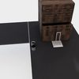
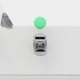
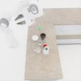


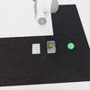
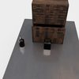
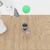
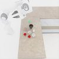
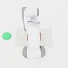


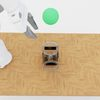

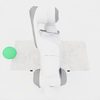

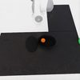
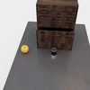
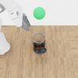
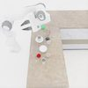


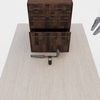

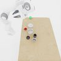


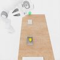
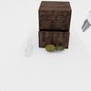
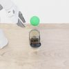
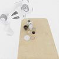


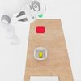
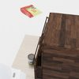
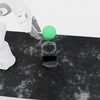
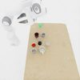


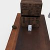
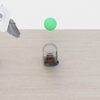

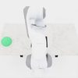


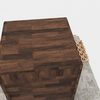
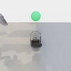

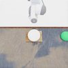


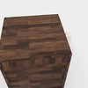


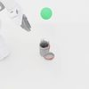


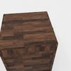
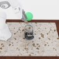

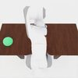


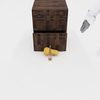
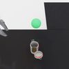

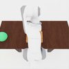
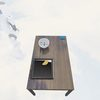
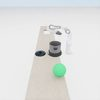
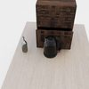


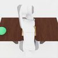
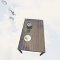
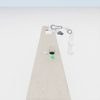
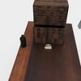
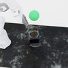


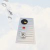
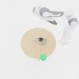
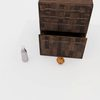


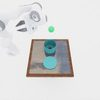
</div>
<p class="mg-gallery-cap"><em>100 task instances generated by the ManiGuard pipelines (sampled from the 6fam-base set).</em></p>

## Explore the docs

<div class="grid cards" markdown>

-   :material-rocket-launch: **[Getting started](getting-started/installation.md)**

    Install the `behavior` conda env and the BEHAVIOR datasets.

-   :material-cube-outline: **[Concepts & foundations](architecture/overview.md)**

    Architecture, the env layer, the LTL safety system, and OmniGibson patches.

-   :material-factory: **[Task generation](pipelines/index.md)**

    Clutter, stack, transfer, lid / liquid / wet, cabinet, jar — and how to add your own.

-   :material-robot-industrial: **[Data collection](data_collection/index.md)**

    SO-101 / GELLO teleop and scripted cuRobo demo collection.

-   :material-brain: **[SFT](sft/end_to_end.md)**

    Controller / action / state / eval consistency, plus the OpenPI recipes.

-   :material-broadcast: **[Evaluation](evaluation/index.md)**

    Websocket policy eval, goal checking, and benchmark preparation.

-   :material-school: **[Reinforcement learning](rl/index.md)**

    SB3 PPO grasp training + the GraspGen / cuRobo grasp-reset pipeline.

</div>

## Repository layout

```
.
├── maniguard/            # ManiGuard package (LTL, task-gen, envs, data, eval, serve, rl)
├── behavior-1k/         # submodule → StanfordVL/BEHAVIOR-1K @ v3.7.2
├── tests/               # maniguard-side pytest suites
├── configs/             # eval / RL / SFT training configs
├── scripts/             # shell entrypoints
├── tools/               # one-off utilities
└── docs/                # this site
```

**Upstream boundary:** anything under `behavior-1k/` is upstream. Don't modify
that tree — patch behaviors via `maniguard._omnigibson_patches` instead.

## Building these docs locally

```bash
pip install mkdocs-material
mkdocs serve            # preview at http://127.0.0.1:8000
mkdocs build --strict   # build to ./site, fail on warnings
```
