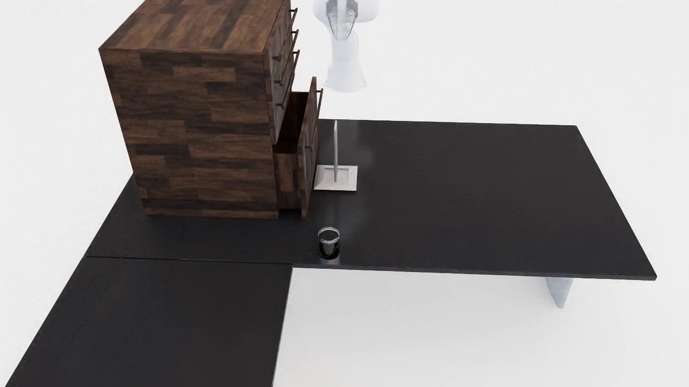
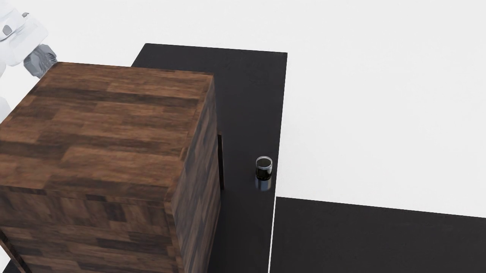
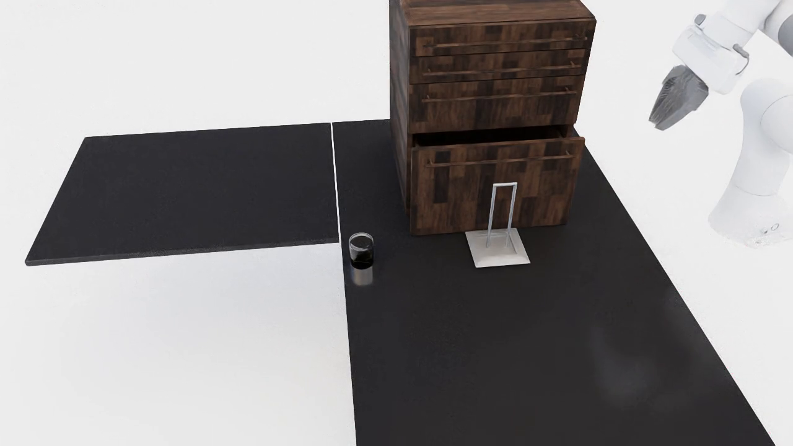

# Cabinet pickup

{ loading=lazy }
{ loading=lazy }
{ loading=lazy }

## What it does

An **empty-scene** pipeline. Starting from a bare floor it synthesizes a
placeable surface (table / desk / counter) fixed at origin, spawns a
bottom-cabinet at the back of the surface's region oriented so its drawer slides
toward the front edge, then computes the drawer cavity's interior AABB at full
extension. The **target pool is fit-filtered** to graspable objects that fit
that interior (per-axis `--interior-margin-m` clearance), and a target — plus
optionally an obstacle — is placed in the drawer's opening path. The Franka is
mounted **on the surface** (edge-aligned), and the task is to open the
partially-cracked drawer and retrieve the target.

Unlike the tabletop pipelines this one uses its own run loop (no
`--scene-model`) and supports the 6-family dataset layout via `--task-id`.

## Gate / validation

The drawer-interior fit-filter runs at **selection time** — only objects that
fit the cavity within `--interior-margin-m` are eligible, so an infeasible
target is never spawned. The rollout itself is LTL-monitored (see below).

## LTL constraints

Generated by `maniguard.utils.task_spec.generate_cabinet_pickup_activity`.

## Source

`maniguard/task_generation/cabinet_pickup_pipeline.py`
