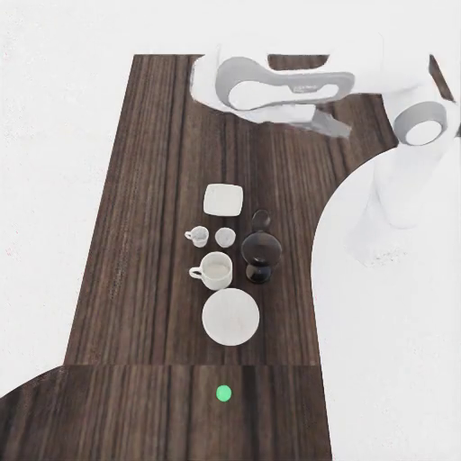
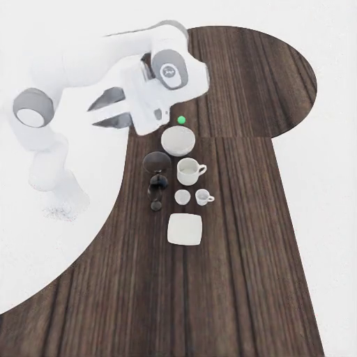

# Clutter

{ loading=lazy }
{ loading=lazy }
{ loading=lazy }

## What it does

Auto-discovers a tabletop in any scene, generates a BDDL activity plus matching `ltl_safety.json`, packs a target object together with fragile and clutter obstacles onto the surface, places the Franka mount at a reachable edge, and runs an LTL-monitored rollout. The robot's task is to retrieve the target from a cluttered tabletop without dropping or tipping any of the fragile items around it.

## Gate checks

Shared base gate: robot/target poses finite, robot base near the floor plane, mount pose collision-free, target inside the reach band (0.20–1.10 m).

Pipeline-specific:
- Pack integrity: `validate_pack_integrity` over the placed pack spec must report `ok=True` (positions match the planned layout within `integrity_tol_xy`).

## LTL constraints

Generated by `maniguard.utils.task_spec.generate_ltl_safety_json` from the selected target and fragile synsets. The combined formula typically monitors:

- `G (!any_fragile_dropped)` — no fragile object on the floor.
- `G (all_fragiles_upright)` — every fragile remains upright (≤45° tilt).
- `G (!target_dropped)` — target never reaches the floor.
- `G (target_upright)` — target stays upright.

## Source

`maniguard/task_generation/clutter_scene_pipeline.py`
