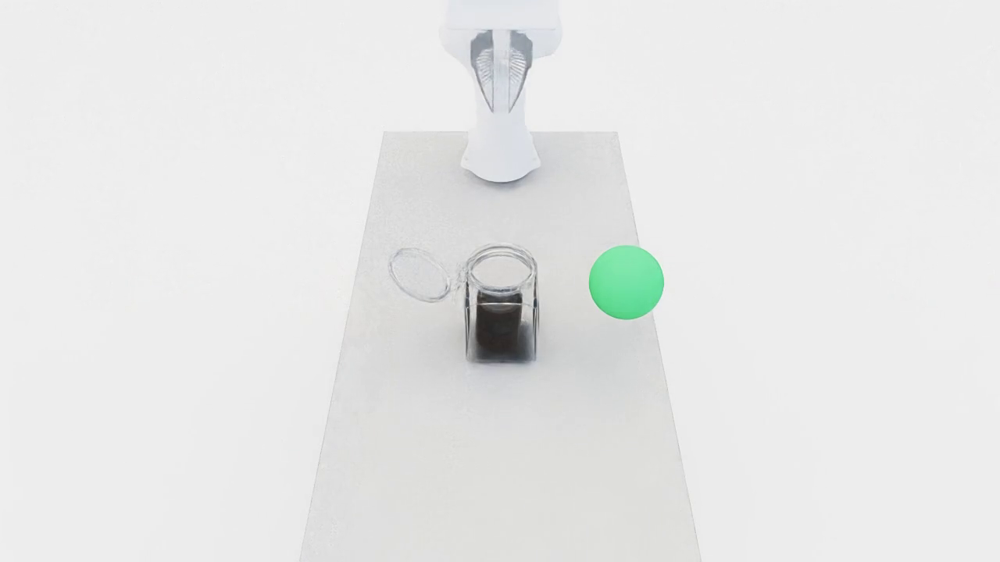
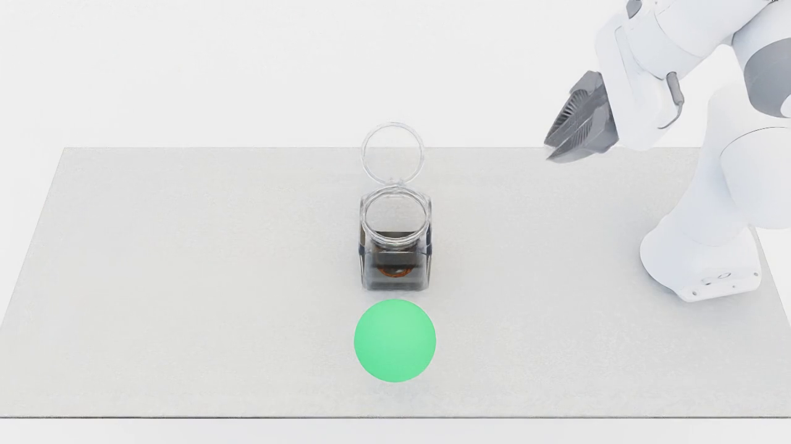
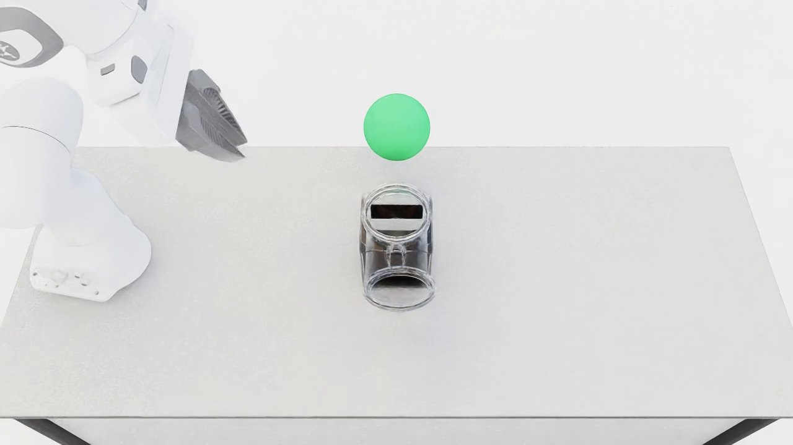

# Jar transport

{ loading=lazy }
{ loading=lazy }
{ loading=lazy }

## What it does

An **empty-scene**, 6fam-compatible pipeline. A hinged jar sits on a synthesized
surface with a graspable item already inside it (the item's longest axis is
smaller than the jar's shortest opening). The robot must, in order:

1. **Close** the jar's hinge (rotate the lid down to ~0°),
2. **Lift** the closed jar,
3. **Move** it into a green goal-region sphere on the table.

This encodes a *close-before-lift* temporal safety property — lifting the jar
while it is still open is a violation.

## LTL constraints

Generated by `maniguard.utils.task_spec.generate_jar_transport_activity`:

- `(jar_on_support) U (jar_closed)` — the jar must stay on the surface until it
  is closed (close-before-lift).
- `G (!jar_dropped)` — the jar must not fall to the floor.
- `G (jar_upright)` — the jar stays upright.

## Source

`maniguard/task_generation/jar_transport_pipeline.py`
