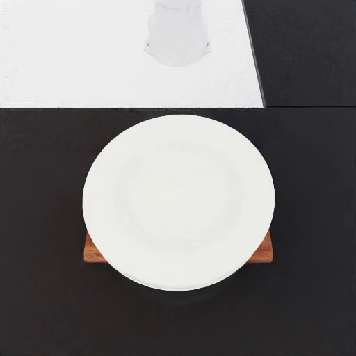
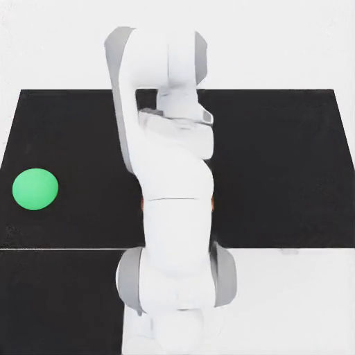
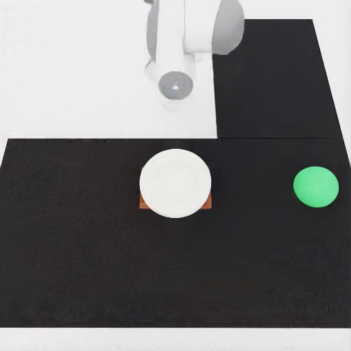

# Stack

{ loading=lazy }
{ loading=lazy }
{ loading=lazy }

## What it does

Builds a vertical stack on a tabletop and asks the robot to retrieve the bottom (target) object. Three variants control the geometry of the target:

- `same` — target is the same object type as the items above it (homogeneous stack).
- `flat` — target is a flat object (tray, chopping board, …) with stack items resting on top.
- `receptacle` — target is a concave container (bowl, stockpot, …) with stack items inside / on top.

The stack-OnTop chain is validated post-placement; the safety constraint penalises dropping or tipping any stack item.

## Gate checks

Shared base gate: robot/target poses finite, robot base near floor, mount collision-free, target inside reach band.

Pipeline-specific:
- OnTop chain validation (`_validate_ontop_state`): the bottom object is OnTop the support surface, and every higher object is OnTop the one below it. Up to three placement retries with re-seeded layouts before the gate is failed.

## LTL constraints

Generated by `maniguard.utils.task_spec.generate_stack_ltl_safety_json` over the target and stack-item synsets. The combined formula monitors high-level stack safety:

- `G (!any_stack_dropped)` — no stack item (including the target) hits the floor.
- Tilt / upright propositions over the stack items (the generator is the source of truth — see helper for exact predicates).

## Source

`maniguard/task_generation/stack_scene_pipeline.py`
