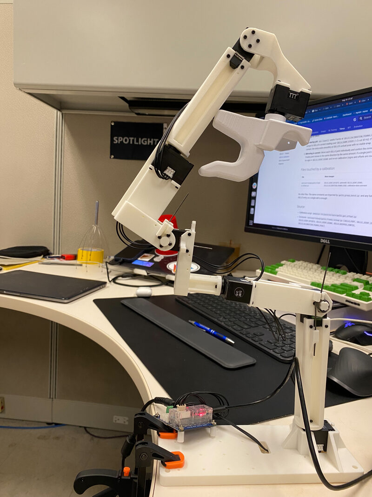

# GELLO calibration

The GELLO leader arm uses Dynamixel servos that report joint position as a
**multi-turn absolute encoder count**, not a normalized angle. Each time
servo IDs are re-flashed, a servo is swapped, finger geometry changes, or
a servo wraps to a different turn count on power-up, the per-joint
multiples-of-π/2 offsets baked into `maniguard/teleop/gello_franka_teleop.py`
go stale and must be regenerated. The result is mirroring that drifts,
jolts at startup, or simply flips the wrong direction.

This page documents the regeneration procedure end-to-end.

## When to recalibrate

| Trigger | Why |
|---|---|
| Re-flashed servo IDs | Joint indexing changes |
| Replaced a servo | Encoder zero shifts |
| Changed finger / gripper geometry | Trim constants no longer reflect physical zero |
| Mirroring drifts or flips at startup | A servo wrapped to a different turn count on power-up |
| New GELLO arm | Everything above |

The current calibration in `gello_franka_teleop.py` is dated **2026-05-10**
(see the comment block above `GELLO_JOINT_OFFSETS`).

## Procedure

### 1. Pose the GELLO at the calibration reference pose

Physically hold the GELLO at the reference pose shown below. This pose
has been validated to give a stable calibration.

{ width="500" }

What you tell `gello_get_offset.py` is `--start-joints 0 0 0 0 0 0 0`,
but the **physical** pose above is not "all joints at literal zero" —
J2, J4, and J6 are intentionally held at non-zero angles. The per-joint
**trims** baked into `GELLO_JOINT_OFFSETS` (currently J2 → −π/4,
J4 → −π/4 − π/9 ≈ −65°, J6 → −0.0175) reconcile the two: after the
trims are applied to the leader's encoder reading, the leader reports
zero on all 7 joints when held in this exact pose.

The matching Franka pose at the same instant is hardcoded in
`GELLO_CALIBRATION_FRANKA_POSE`. If you change the physical reference
pose, you must update **both** the trims in `GELLO_JOINT_OFFSETS` and
the corresponding entries in `GELLO_CALIBRATION_FRANKA_POSE` — the two
constants are paired.

!!! tip "Brace the arm"
    Use a fixture, a clamp, or a second person to hold the GELLO
    rigidly in this pose during the calibration run. Drift of even a
    few degrees on any joint will get baked into the offsets and show
    up later as a startup jolt or persistent mirroring error.

### 2. Run the calibration script

The script lives in the bundled `joylo` submodule:

```bash
conda activate behavior

python behavior-1k/joylo/scripts/gello_get_offset.py \
  --port /dev/serial/by-id/usb-FTDI_USB__-__Serial_Converter_FTB8HNJP-if00-port0 \
  --start-joints 0 0 0 0 0 0 0 \
  --joint-signs 1 -1 1 1 1 1 1 \
  --gripper False
```

Flag notes:

| Flag | Value used in ManiGuard | Source-of-truth constant |
|---|---|---|
| `--port` | FTDI by-id path above | `GELLO_PORT` |
| `--start-joints` | `0 0 0 0 0 0 0` | reference pose (paired with `GELLO_CALIBRATION_FRANKA_POSE`) |
| `--joint-signs` | `1 -1 1 1 1 1 1` | `GELLO_JOINT_SIGNS` |
| `--gripper` | `False` | `GELLO_GRIPPER_CONFIG = None` (no physical gripper attached) |

The script sleeps 3 seconds, then prints best offsets in two forms — raw
floats and as integer multiples of π/2.

### 3. Interpret the output

Expected output looks like:

```
best offsets               :  ['4.712', '3.142', '6.283', ...]
best offsets function of pi: [3*np.pi/2, 2*np.pi/2, 4*np.pi/2, ...]
```

Use the **`function of pi`** form. Each entry is the raw multiple of π/2
that maps the Dynamixel encoder reading at the reference pose to your
desired `start_joints`.

If a joint also needs a trim (because the physical reference pose isn't
exactly the desired calibrated zero — e.g. J2 is held at -π/4 instead of
0), add the trim explicitly:

```
delta_offset = -CALIB_POSE[i] * sign[i]
```

The current 2026-05-10 calibration uses trims on J2, J4, J6 (see comments
inline in `GELLO_JOINT_OFFSETS`).

### 4. Update the constants

Edit `maniguard/teleop/gello_franka_teleop.py` and replace **`GELLO_JOINT_OFFSETS`**
(currently around line 83) with the new values.

If you changed `--joint-signs`, also update `GELLO_JOINT_SIGNS`.

If you changed the physical reference pose, also update
`GELLO_CALIBRATION_FRANKA_POSE` to match.

Update the comment block above `GELLO_JOINT_OFFSETS` to record:

- the new calibration date,
- which servos wrapped (changed multiples of π/2 vs the previous calibration),
- which trims changed (vs the previous calibration).

This audit trail is what lets future you tell a "wrapped on power-up"
recalibration apart from a "real" hardware change.

### 5. Verify

Restart the teleop entry point:

```bash
python -m maniguard.teleop.gello_franka_teleop \
  --snapshot <some_snapshot.json>
```

Two things to check:

1. **No startup jolt.** `env.reset()` seeds Franka at
   `GELLO_CALIBRATION_FRANKA_POSE`, then ramps to GELLO's current reading
   over `GELLO_RAMP_STEPS` (~2 s at 30 Hz). If calibration is correct, the
   ramp ends smoothly at GELLO's actual pose with no visible snap.
2. **Mirroring is correct.** Move each GELLO joint individually and confirm
   the corresponding Franka joint moves in the same direction by the same
   amount. If a single joint is inverted, flip its sign in `GELLO_JOINT_SIGNS`
   and re-run calibration (signs and offsets are coupled).

## Files touched by a calibration

| File | What changes |
|---|---|
| `maniguard/teleop/gello_franka_teleop.py` | `GELLO_JOINT_OFFSETS`, optionally `GELLO_JOINT_SIGNS`, `GELLO_CALIBRATION_FRANKA_POSE`, calibration-date comment |

No other files. The same constants are imported by `gello_grasp_batch.py`
and any future GELLO entry, so a single edit is enough.

## Source

- Calibration script: `behavior-1k/joylo/scripts/gello_get_offset.py`
- Constants: `maniguard/teleop/gello_franka_teleop.py` (`GELLO_PORT`,
  `GELLO_JOINT_IDS`, `GELLO_JOINT_OFFSETS`, `GELLO_JOINT_SIGNS`,
  `GELLO_GRIPPER_CONFIG`, `GELLO_CALIBRATION_FRANKA_POSE`)
